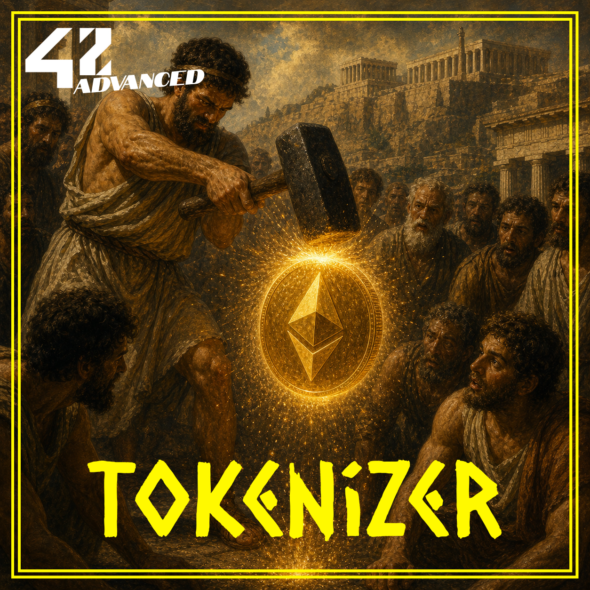
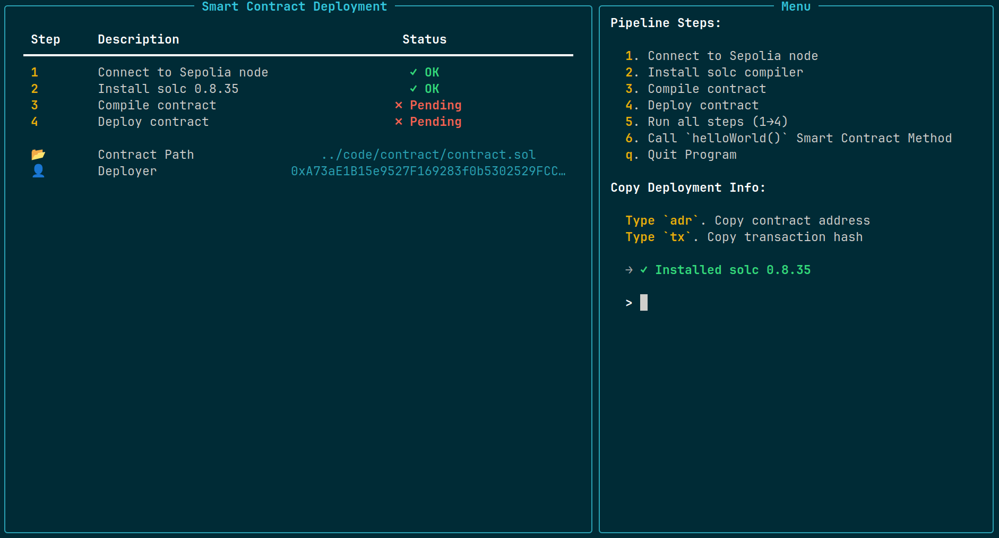

<p align="center">
  
</p>

## 🚀 SYNOPSIS

`tokenizer` is an introduction to blockchain, Smart Contract and Token crafting.
The goal of this project is to create an `ERC-20` Smart Contract resulting in a token creation on the Ethereum Sepolia testnet.

The project demonstrates:
- **Smart Contract Development**: Creating a token using Solidity and the ERC-20 standard
- **Secure Implementation**: Using OpenZeppelin's battle-tested libraries
- **Python-Driven Deployment**: A custom deployment pipeline using `web3.py`, `py-solc-x`, and `Rich` for a clean TUI
- **Wallet Management**: Interactive tools to generate wallets and manage tokens on-chain

## ✨ FEATURES

Key features of `tokenizer` include:

- **ERC-20 Token Creation**  
  Deploy your own `UselessToken42` (UT42) token to the Ethereum Sepolia testnet.

- **OpenZeppelin Integration**  
  Inherits from OpenZeppelin's audited, battle-tested `ERC20.sol` implementation for maximum security.

- **Python Deployment Pipeline**  
  Automated compilation and deployment via a Terminal User Interface (TUI) using Rich.

- **Interactive Wallet Manager**  
  Generate Ethereum wallets on the fly, check Sepolia ETH balances, and transfer custom tokens.

- **Solc Compiler Management**  
  Automatic installation of the required Solidity compiler (`solc v0.8.35`).

- **Contract Interaction**  
  Call smart contract methods directly from the TUI after deployment.

- **Docker Support**  
  Full Docker and Docker Compose setup for containerized deployment.

## 🖥️ INSTALLATION

To get started with `tokenizer`, follow these steps:

### Prerequisites

- **Docker and Docker Compose > 3.8**

1. Clone the repository:
   ```bash
   git clone https://github.com/maitreverge/tokenizer.git
   ```

2. **Navigate to the project directory:**
   ```bash
   cd tokenizer
   ```

3. **Create your environment configuration:**
   ```bash
   cp deployment/.env.example deployment/.env
   ```
   Then edit `deployment/.env` and fill in your credentials:
   - `MY_PUBLIC_KEY`: Your Ethereum wallet address
   - `MY_PRIVATE_KEY`: Your private key for signing transactions
   - `CONTRACT_ADDRESS`: The Smart Contract

> [!WARNING]
> The `CONTRACT_ADDRESS` is here for reminder purposes. This will need to be filled later.

> [!NOTE]
> Make sure that your wallet have at least 0.5 Sepolia ETH, the testnet currency, to pay for gas fees.
> You can request Sepolia ETH from a faucet such as Alchemy, QuickNode, or Infura.


This is the `.env.example` content :
```
SEPOLIA_ENTRYPOINT=https://ethereum-sepolia-rpc.publicnode.com
SMART_CONTRACT_PATH=../code/contract/contract.sol
WALLETS_FILE=./wallets/wallets.txt
CONTRACT_ADDRESS=to_fill_later
MY_PRIVATE_KEY=
MY_PUBLIC_KEY=
```


4. **Build the Docker container:**
   ```bash
   docker compose build
   ```

5. **Launch the container:**
   ```bash
   docker compose run --rm tokenizer
   ```

## ⚙️ USAGE

### Deploying the Smart Contract

Navigate to the deployment directory and run the contract uploader:

```bash
python3 contract_uploader.py
```

The TUI will guide you through:
1. **Connect to Sepolia node** – Establish connection to the blockchain
2. **Install solc compiler** – Set up the Solidity compiler
3. **Compile contract** – Compile `contract.sol` into ABI and bytecode
4. **Deploy contract** – Broadcast the deployment transaction
5. **Call `helloWorld()`** – Test the deployed contract

<p align="center">
  
</p>

### Interacting with Tokens

> [!NOTE]
> This second part assumes that you have successfully deployed the Smart Contract and have the `CONTRACT_ADDRESS` filled in your `.env` file.

Do do such, you can export the contract address from the TUI after deployment, or copy it from the `deployment/.env` file.

```
CONTRACT_ADDRESS=0xYourDeployedContractAddress
```

or

```bash
export CONTRACT_ADDRESS=0xYourDeployedContractAddress
```

> [!IMPORTANT]
> The wallet manager is a separate tool which was not mandatory for the contract deployment. It is an additional utility to manage wallets and tokens, and allows you to interact with the deployed contract.

---

Launch the wallet manager to manage your token ecosystem:

```bash
python3 wallet_manager.py
```

Features include:
- **Generate Wallets**: Create new Ethereum wallets on the fly
- **Check Balances**: View Sepolia ETH and custom token balances
- **Copy Addresses**: Easily copy wallet addresses to clipboard

## 🗂️ PROJECT STRUCTURE

- **code/contract/**  
  Smart contract source code (`contract.sol` – UselessToken42 ERC-20 token)

- **deployment/**  
  Deployment scripts, utilities, and configuration
  - `contract_uploader.py` – Smart contract TUI deployment tool
  - `wallet_manager.py` – Interactive wallet management tool
  - `utils/` – Core utility functions
  - `requirements.txt` – Python dependencies

- **documentation/**  
  Technical documentation
  - `1_technical_choices.md` – Architecture and technical decisions
  - `2_environment_setup.md` – Environment configuration guide
  - `3_deployment_guide.md` – Step-by-step deployment instructions
  - `4_wallet_management.md` – Wallet manager usage guide

- **.img/**  
  Project logo and assets

- **Dockerfile** & **docker-compose.yml**  
  Docker container configuration

## 🚧 LIMITATIONS

- Requires Sepolia ETH (via faucet) to pay for gas fees
- Requires valid private key configuration in `.env`
- Deployment uses Sepolia testnet only (not for production Mainnet)
- Contract supply is fixed at deployment (42 tokens, no inflation)
- No minting functions after initial deployment

## 🧑‍💻 AUTHOR

- **Florian VERGE** ([@maitreverge](https://github.com/maitreverge)) – Design, core logic, smart contract development

## 📜 LICENCE

This project is licensed under the **MIT License**.

## 🤝 CONTRIBUTING

Contributions are welcome! Open a GitHub Issue or submit a Pull Request 🚀
